# DC-1

**Repozytorium GitHub:** [https://github.com/malak4822/Bezpiecze-stwo](https://github.com/malak4822/Bezpiecze-stwo)

---

## 1. Rozpoznanie 

Pierwszym etapem było zidentyfikowanie adresu IP maszyny w sieci lokalnej oraz sprawdzenie otwartych portów.

### Skanowanie portów
Wykonano skanowanie narzędziem **Nmap** z flagą `-sV` w celu identyfikacji wersji usług:
`nmap -sV [IP_OFIARY]`

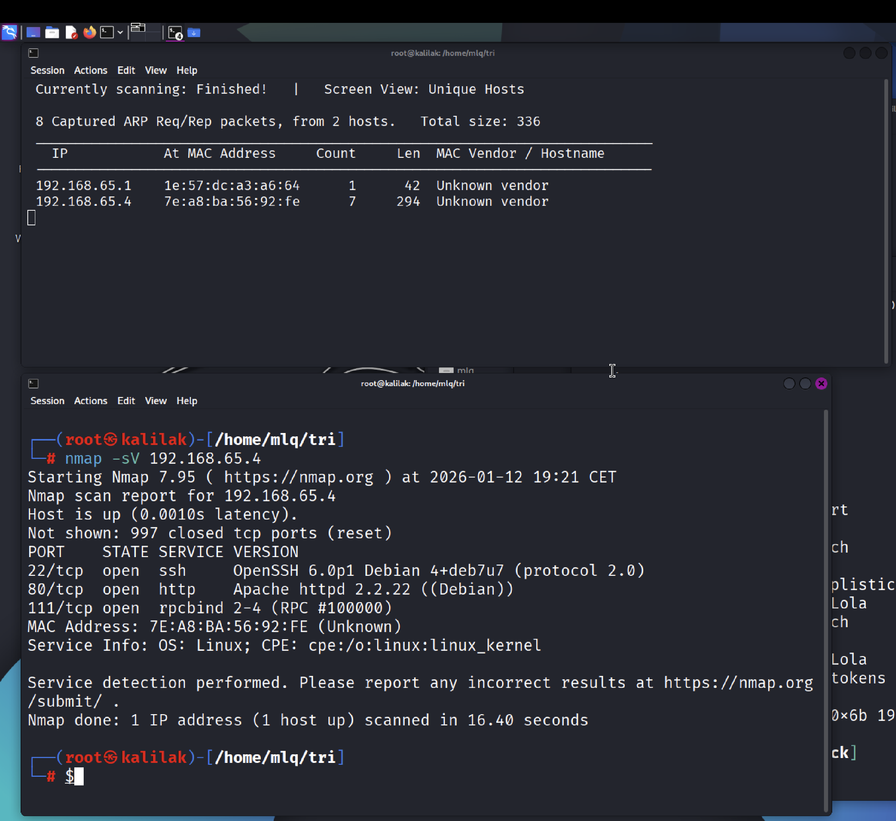{width=80%}

Wynik skanowania ujawnił otwarty port **80 (HTTP)** działający na serwerze Apache oraz informację o systemie CMS: **Drupal 7**.

### Analiza podatności webowych
W celu potwierdzenia wersji i znalezienia potencjalnych błędów konfiguracyjnych użyto skanera **Nikto**:
`nikto -h [IP_OFIARY]`

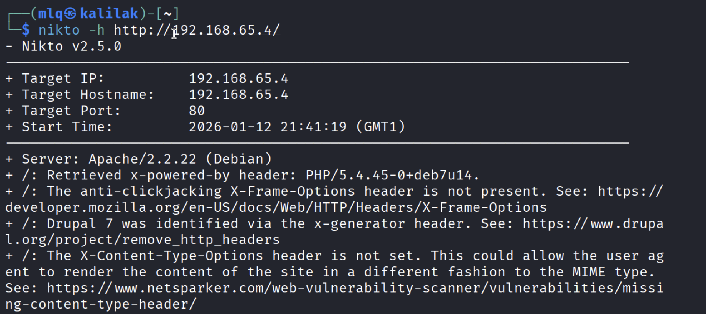{width=80%}

Narzędzie potwierdziło, że mamy do czynienia z przestarzałą wersją Drupala 7, co sugeruje wysoką podatność na znane ataki.

---

## 2. Eksploitacja - Uzyskanie dostępu do panelu

Przeszukano bazę exploitów pod kątem Drupala 7. Znaleziono podatność pozwalającą na wstrzyknięcie SQL lub zdalne wykonanie kodu (Drupalgeddon).

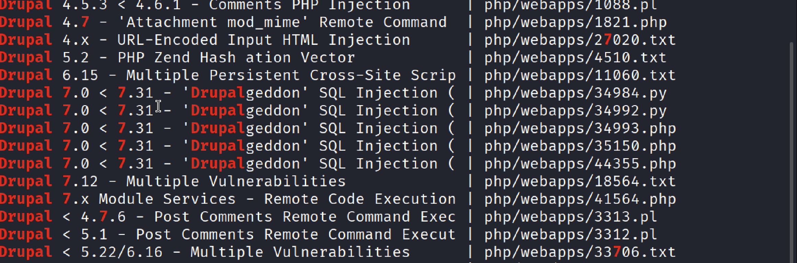{width=80%}

Wybrano exploit pozwalający na utworzenie nowego konta administratora poprzez manipulację bazą danych (SQLi). Uruchomienie skryptu:

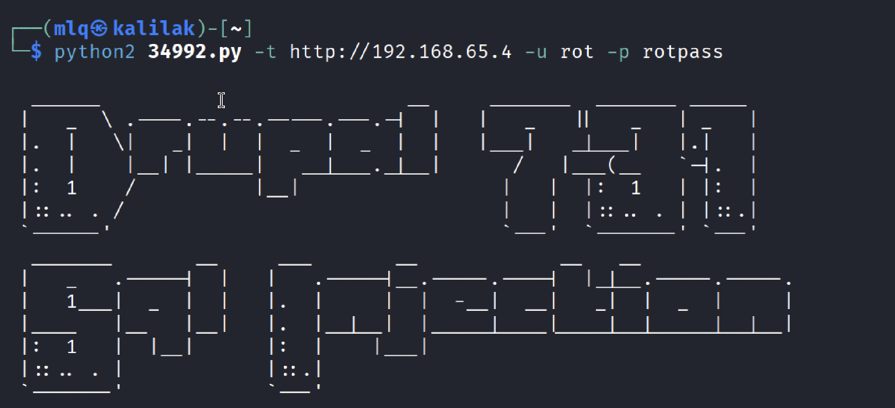{width=80%}

Atak zakończył się sukcesem. Hasło administratora zostało zresetowane/dodano nowego użytkownika, co pozwoliło na zalogowanie się do panelu webowego.

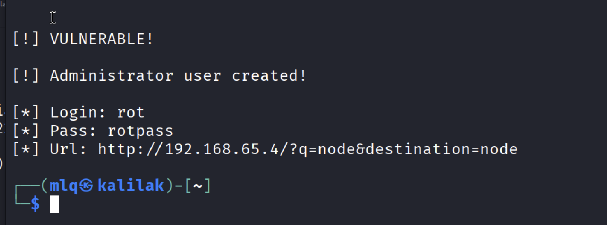{width=80%}

### Zdobycie Flagi nr 3
Po zalogowaniu się do panelu administracyjnego (GUI), w sekcji **Dashboard** odnaleziono jedną z flag widoczną tylko dla zalogowanych użytkowników.

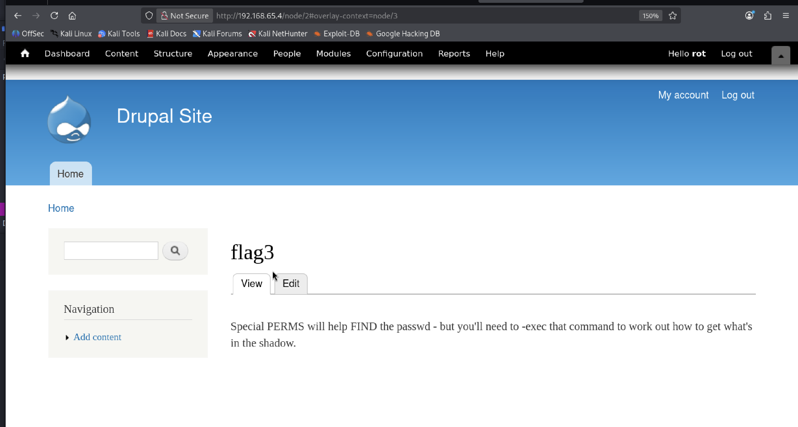{width=80%}

---

## 3. Eskalacja do powłoki systemowej

Dostęp przez stronę WWW był niewystarczający. W celu uzyskania dostępu do terminala (CLI) zdecydowano się użyć exploita **EDB-44449** (Ruby), który pozwala na zdalne wykonanie kodu (Remote Code Execution).

### Problemy z zależnościami
Podczas próby uruchomienia exploita wystąpił błąd związany z brakiem odpowiedniej biblioteki w środowisku Ruby:

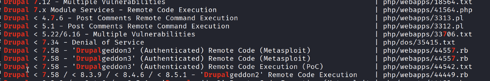{width=80%}

Analiza błędu wykazała, że zainstalowana wersja Ruby jest zbyt nowa i brakuje kompatybilnej wersji biblioteki `highline`.

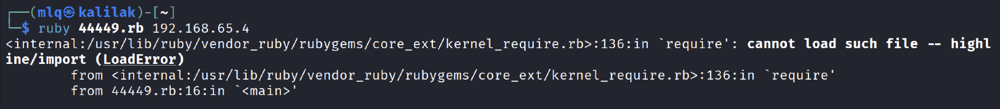{width=80%}

**Rozwiązanie:** Ręczna instalacja starszej wersji biblioteki `highline`:
`sudo gem install highline -v 2.1.0`

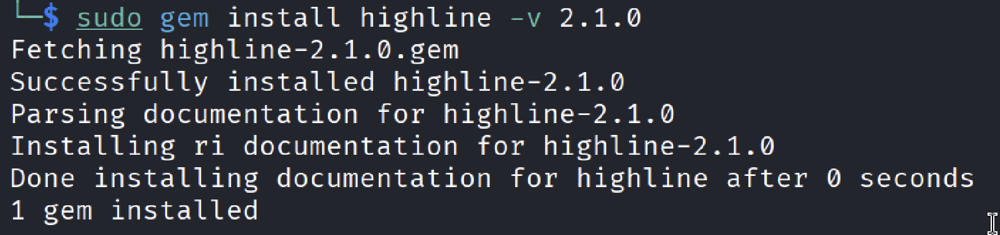{width=80%}

### Uzyskanie powłoki 
Po naprawieniu zależności, exploit został uruchomiony ponownie, celując w maszynę ofiary. Tym razem skrypt zadziałał poprawnie, otwierając sesję powłoki.

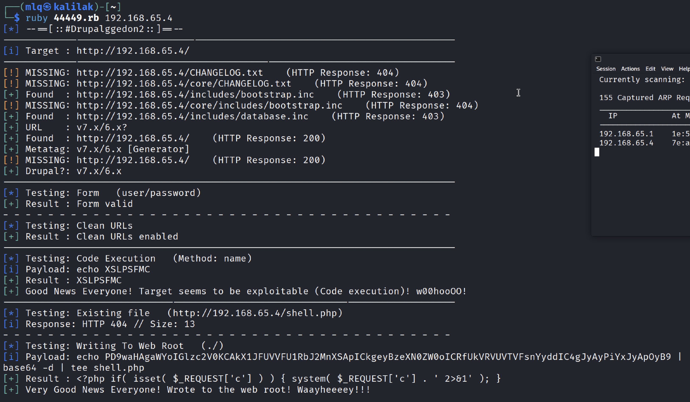{width=80%}

---

## 4. Post-eksploitacja

Będąc w systemie, przeprowadzono rekonesans katalogów. W głównym katalogu serwera WWW (`/var/www`) odnaleziono plik `flag1.txt`.

**Treść flagi nr 1:**

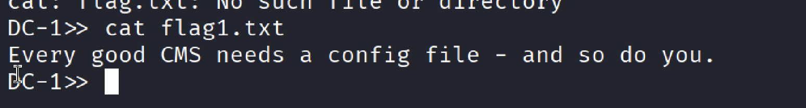{width=80%}

No i koniec